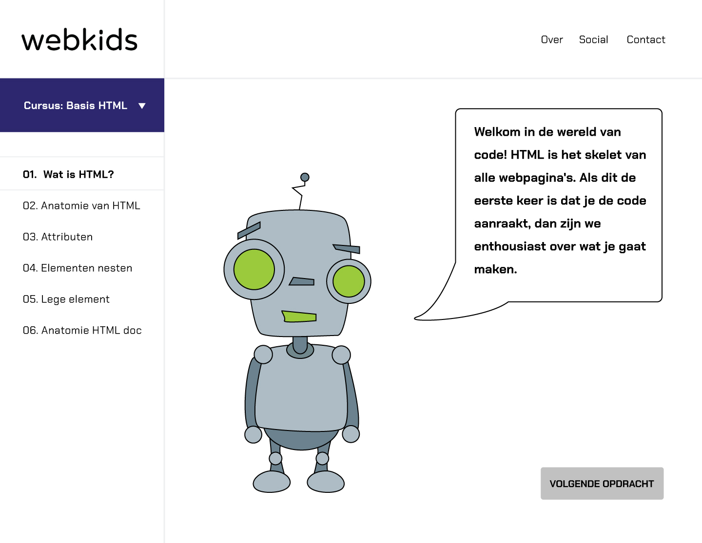

# Concept

In dit hoofdstuk vind je de concepten die zijn bedacht als oplossing voor het probleem. Met behulp van de [moodboards](moodboard.md#moodboard-1-0) zijn wat concepten gevisualiseerd. De concepten zullen hieronder toegelicht worden. Daarnaast wordt er ook toelichting gegeven over het uiteindelijk gekozen concept.

Zie hieronder de concepten:



### **Concept 1 - Verzamelpagina**

**Voorbeeld**

**Omschrijving**  
Het eerste concept is een verzamelpagina voor bestaande lesmaterialen over programmeren.  
De website bevat lesmaterialen die de docent kan verwerken in zijn/haar eigen les. Elk onderwerp heeft zijn eigen manier van leren programmeren. Scratch maakt bijvoorbeeld gebruik van codeblokjes die je aan elkaar moet verbinden om interactie te creëren. Arduino daarentegen biedt de mogelijkheid om met een boordcomputer, externe componenten met elkaar te laten communiceren\(robotica\).



### **Concept 2 - Game**

**Voorbeeld**

**Verzamelpagina**  
Het tweede concept is een game voor kinderen in de leeftijd 8-12 jaar \(bovenbouw\) uit het basisonderwijs. De game leert je stap voor stap de basis van HTML en CSS op een speelse en creatieve manier.



### **Concept 3 - Online leeromgeving**

**Voorbeeld**

**Verzamelpagina**  
Het derde concept is een online leeromgeving voor docenten die lesgeven in het basisonderwijs. Met de leeromgeving kunnen ze op hun gemak de basis van HTML en CSS leren. Daarnaast kan de docent zijn/haar proces bijhouden en is er ook een community waar je gebruik van kan maken als je ergens tegenaan loopt.



### Gekozen concept - Online leeromgeving

Met behulp van de feedback die is verzameld uit de [interviews](../onderzoek-and-inspiratie/4.-interviews.md) met experts en de [bevindingen](../onderzoek-and-inspiratie/2.-probleem.md#vragenlijst-bevindingen) uit de vragenlijst is de keuze gemaakt om de online leeromgeving verder uit te werken.

Nadat ik op gesprek ging bij experts en mijn eerste [concept](concept.md) voorlegde \(verzamel pagina\) gaven ze al snel aan dat dit te makkelijk zou zijn. Er zijn namelijk al genoeg websites die hetzelfde doen. Zij gaven als advies: hou het product klein, concreet of verbeter/versimpel een bestaand product. 

Voor concept 2 \(game\) waren een aantal experts wel enthousiast, alleen het idee vonden ze niet realistisch. Zo gaf Squla aan dat niet alle kinderen willen programmeren omdat de interesses per kind kan verschillen. Daarnaast moest ik mij ook afvragen waarom zij na hun schooltijd nog zouden gaan programmeren, als zij ook op de playstation, xbox of met hun vrienden kunnen spelen. Met andere woorden; de interesse moet echt vanuit het kind komen, waarbij de ouders het kind kunnen motiveren om naast school aan de slag te gaan. 

Op dit moment dreigt het basisonderwijs achter te lopen met digitale vaardigheden. Uit mijn onderzoek is gebleken dat, het gebrek aan de juiste middelen en kennis over digitale vaardigheden bij de docenten de hoofdoorzaken zijn. Daarnaast heeft een overvol rooster ook veel invloed op de docent en houden de meeste scholen zich vast aan hun vastgeroeste leermethodes, waardoor er geen plek of tijd is om een nieuw vak te introduceren.

Al met al geven docenten aan dat ze ervoor open staan om nieuwe dingen te leren als het toegepast kan worden in het onderwijs. Met de online leeromgeving kunnen zij op hun gemak de basis van HTML en CSS leren. Zo zijn de lessen opgedeeld in modules en wordt er stap voor stap uitgelegd over de werking en hoe het toegepast kan worden. Programmeren leer je door te doen, en om kennis over te brengen moet je weten waarover je het hebt en waarvoor het dient. De opgedane kennis kunnen de docenten vervolgens overdragen aan de leerlingen door het te verwerken in hun lesprogramma. Ook is de online leeromgeving meer levensvatbaar dan de game, omdat het op een lange termijn uitgebreid kan worden voor meerdere mensen naast alleen docenten. Daarnaast kan de leeromgeving eens in de zoveel tijd geüpdatet worden met nieuwe lesmodules over de nieuwste technieken rondom programmeren.

Met behulp van de Harris Profile \(zie afbeelding hieronder\) heb ik de game en de online leeromgeving naast elkaar afgewogen op basis van de [user requirement list](user-requirement-list.md). In één opslag is gelijk te zien welke het beste uit de test komt. In dit geval de online leeromgeving. Het enige minpunt is dat de opdrachten bij de online leeromgeving minder speels ogen dan bij de game. Maar hiervoor zal een balans in gevonden moeten worden. 

