# Visuals

Uit mijn test had ik als [feedback](../prototype/#feedback-prototype-v-0-1) gekregen dat sommige wireframes nog onduidelijk zijn. Dit kwam omdat de wireframes geen visuele representatie hadden, waardoor het moeilijk was voor iemand zonder technische of visuele aanleg om in te schatten waarvoor elke wireframe dient. In dit hoofdstuk vindt je de wireframes maar dan in kleur.  

### Visual v0.1

### Frontpage - home

### Frontpage - Hoe het werkt

### Frontpage - Over ons

### Frontpage - Contact

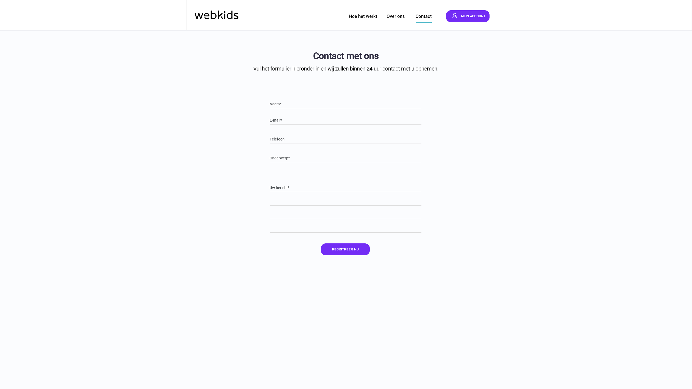

### Niveau check

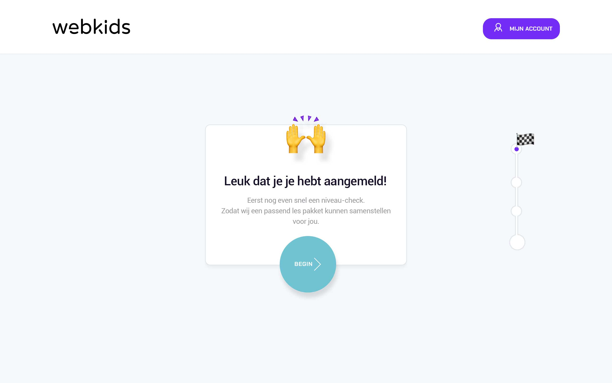

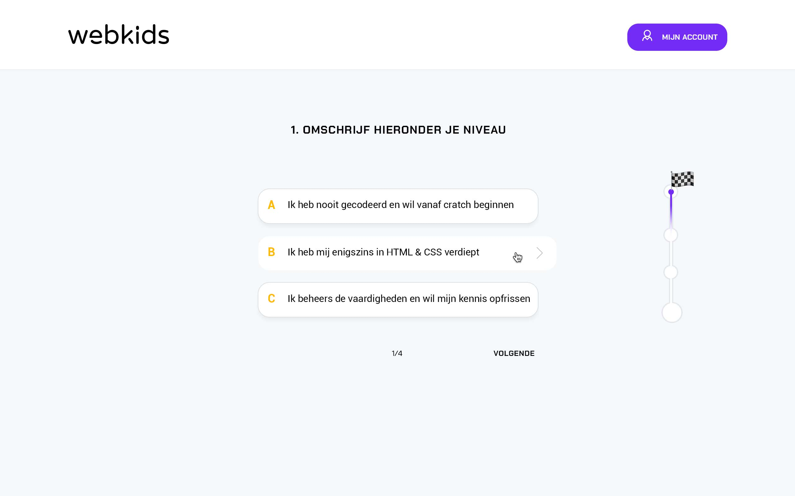

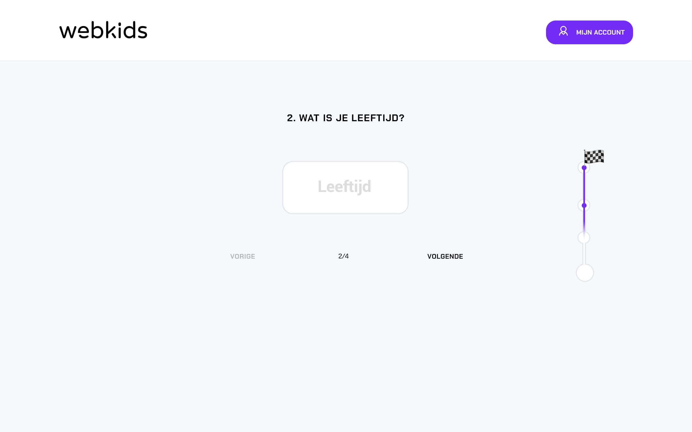

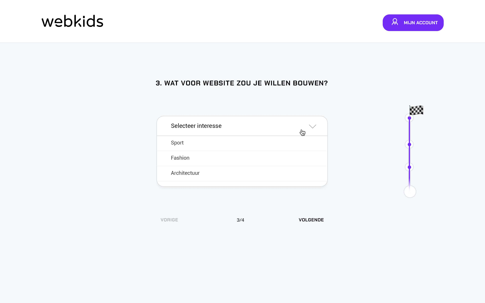

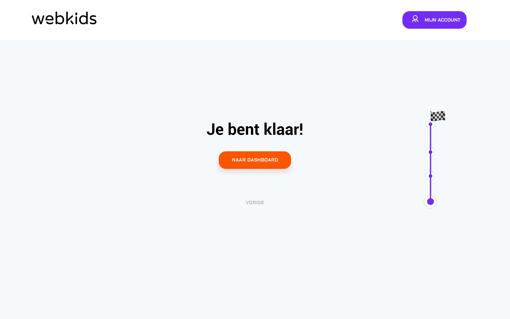

### Dashboard/home

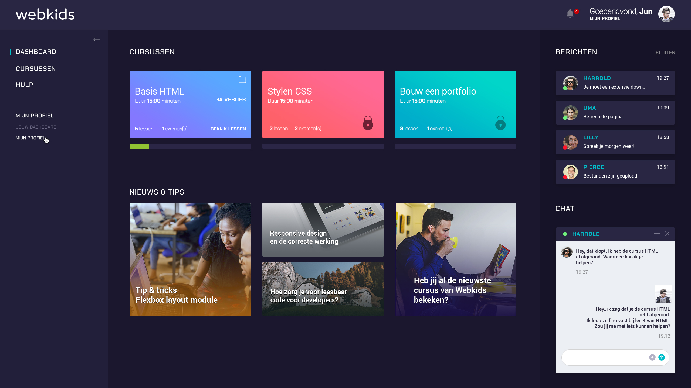

### Cursus - opdrachten overzicht

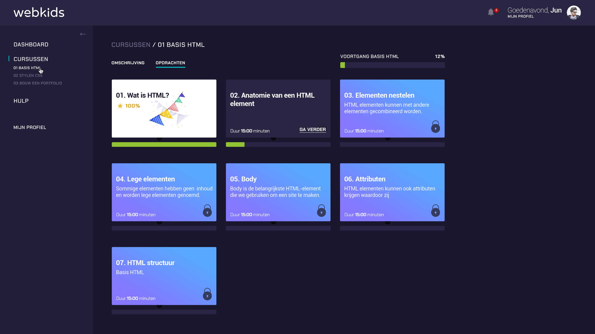

### Cursus - omschrijving

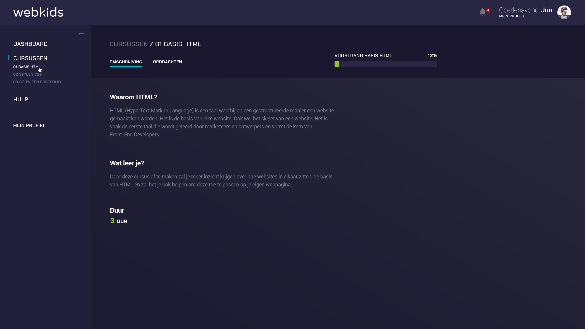

### Opdracht 1

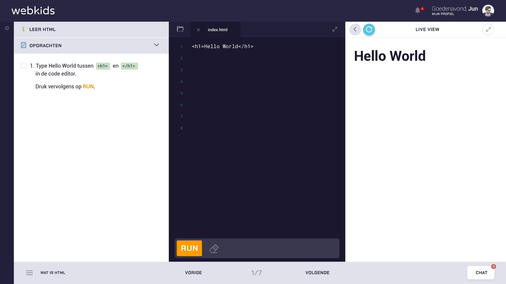

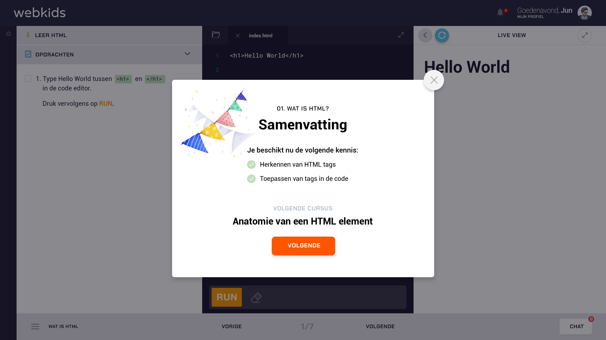

Visuals v0.1 is nog niet compleet. De schermen die hier worden getoond geeft een visuele impressie van hoe het uiteindelijke product eruit komt te zien. In [visuals v0.2](visuals-0.2.md) heb ik de eerste les volledig uitgewerkt.

