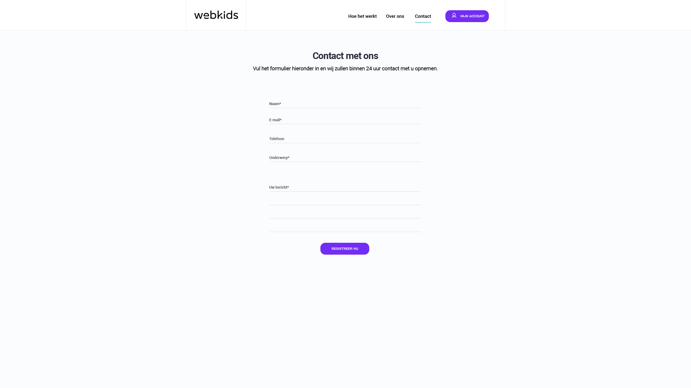
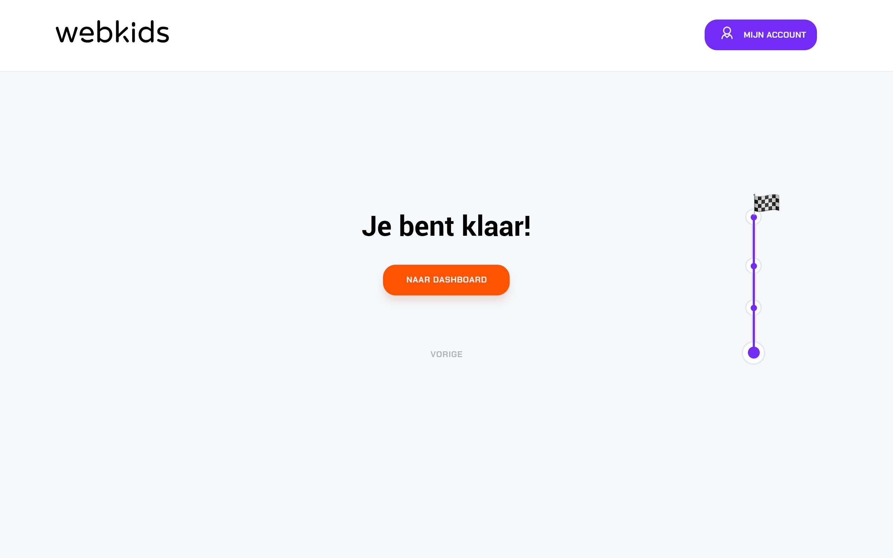
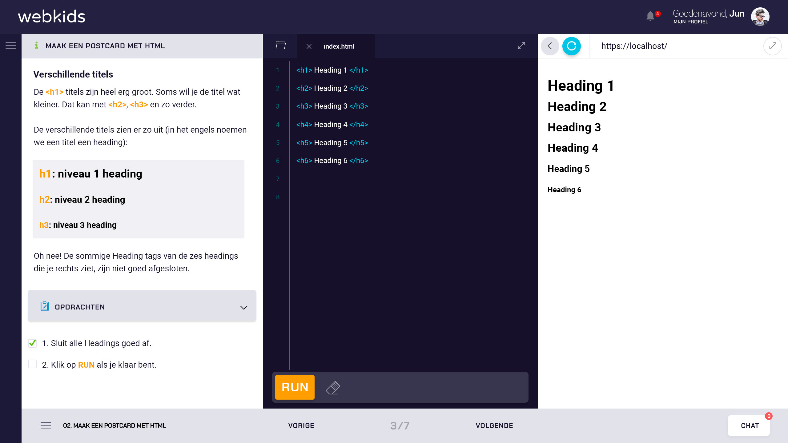

# Visuals v0.2A

### Wat is er toegevoegd in visuals 0.2A

1. meerdere schermen o.a. alle opdrachten van de html cursus zijn uitgewerkt.
2. Als feedback kreeg ik dat je werd geconfronteerd met drie schermen\(uitleg, editor en live viewer\) zodra je de opdrachten gaat maken. hiervoor is een soort tutorial toegepast waarbij alle vlakken worden toegelicht voordat je begint aan de opdrachten

### Visuals v0.2A

### Frontpage - home 

### Frontpage - Hoe het werkt 

### Frontpage - Over ons 

### Frontpage - Contact 

### Niveau check 

### Dashboard/home 

### Cursus - omschrijving 

### Cursus - opdrachten overzicht 

### Tutorial \(uitleg over hoe de leeromgeving werkt\)

### Opdrachten

### Opdracht 2

### Opdracht 3

### Opdracht 4

### Opdracht 5

### Opdracht 6

### Opdracht 7

Voor prototype v0.2A is ook een klikbaar prototype gemaakt. Met de prototype ben ik langs een paar basisscholen geweest om het te testen met de docenten. Deze test kan je terugvinden in [prototype test](../../validatie/prototype-testen.md). Met de feedback die is gegeven is vervolgen een iteratie gemaakt, deze kan je vinden onder het kopje [visuals v02.B](visuals-v0.2b.md).

