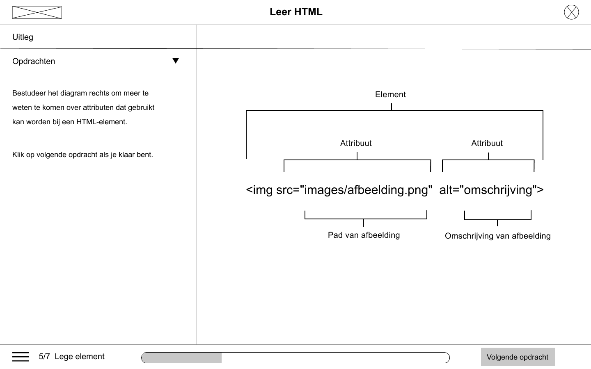
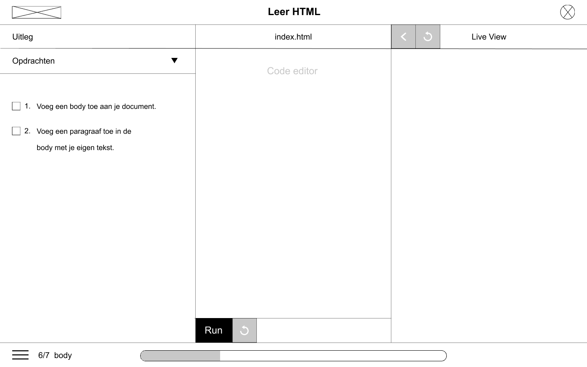

# Wireframes

Hier vind je de wireframes van het [gekozen concept](../../ideeen-and-inzichten/concept.md#gekozen-concept-online-leeromgeving). De schermen zijn gesorteerd op volgorde. Elke rij laat een andere scherm zien. De rijen die eronder vallen zijn de verschillende states van het desbetreffende scherm. 

### **Wireframes v0.1**

### **Overzicht van alle schermen**

Een overzicht van alle belangrijke schermen

### **Registratiescherm**

Hieronder zie je het registratie- en inlogscherm

### Dashboard/Home

Nadat je je hebt geregistreerd en ingelogd bent op je account, dan kom je op het onderstaande scherm terecht. Dit is de dashboard of ook wel je persoonlijke homepage. Hier zie je terug waar je bent gebleven met de cursus, maar ook het laatste nieuws over het onderwerp programmeren.

### Cursus overzicht

Het onderstaande scherm laat een overzicht zien van alle cursussen die aangeboden worden. Het slotje betekent dat je de cursus moet ontgrendelen. Ontgrendelen kan je door voorgaande cursussen af te ronden. Nadat je je hebt aangemeld voor een cursus, krijg je informatie over de cursus.

### **Opdrachten** 

Hieronder zie je een overzicht van alle opdrachten van de cursus 'Leer HTML'. 

Stel de gebruiker klikt op opdracht 2, dan komt hij/zij op de onderstaande scherm terecht. Alle opdrachten hebben dezelfde lay-out op, alleen de content verschilt per opdracht. Hieronder laat ik alle belangrijke states zien per opdracht.

####  **Opdracht 2**

#### Opdracht 3

#### Opdracht 4

#### **Opdracht 5**

#### **Opdracht 6**

#### **Opdracht 7**

Nadat je alle opdrachten goed heb afgerond, krijg je een samenvatting van alle onderwerpen die tijdens de cursus zijn behandeld. Hiermee weet de gebruiker weer wat die heeft geleerd.

Wireframes v0.1 is omgezet tot een klikbaar prototype, deze is te vinden bij [prototype](../prototype/#prototype-v-0-1). Daarnaast is de prototype ook getest op de doelgroep, de feedback op de prototype kan gevonden worden bij [Feedback prototype v0.1](../prototype/#feedback-prototype-v-0-1). Met de feedback heb ik nieuwe wireframes gemaakt, deze zijn te vinden bij [Wireframes v0.2.](wireframes-v0.3.md)

