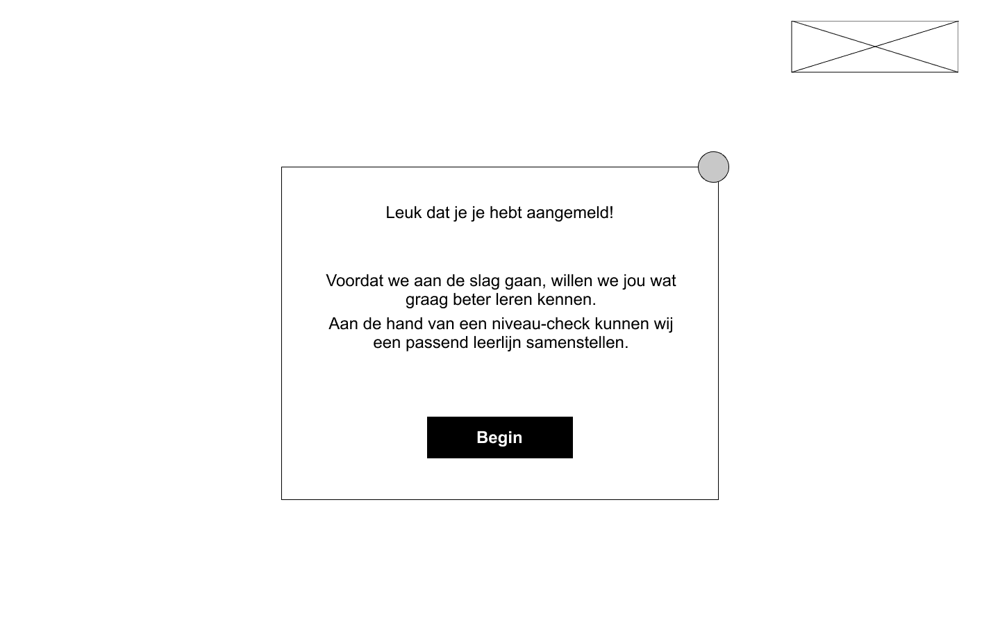
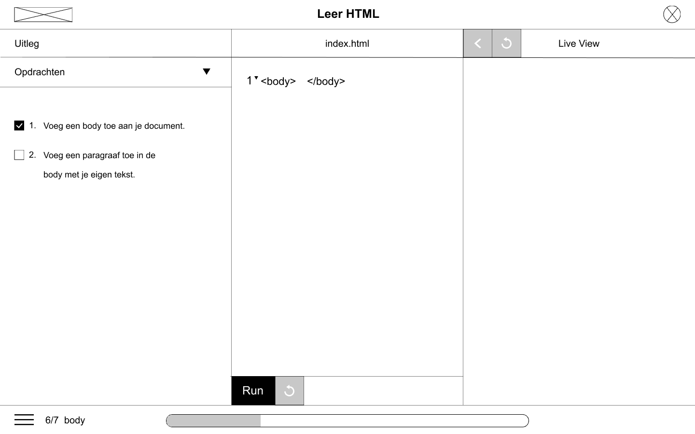

# Wireframes v0.2

Wireframes v0.2 is een iteratie op de wireframe v0.1. Na het testen van prototype v0.1 heb ik de feedback meegenomen en verwerkt in v0.2. De feedback die is gegeven op prototype v0.1 is te zien onder het kopje [prototype v0.1](../prototype/#feedback-prototype-v-0-1).

### Wat is er veranderd in V0.2?

1. Niveau check nadat de gebruiker zich heeft ingelogd.
2. puntsgewijze samenvatting na elke opdracht.

### Wireframes v0.2 

### **Overzicht van alle schermen**

Een overzicht van alle belangrijke schermen

### **Registratiescherm**

Hieronder zie je het registratie- en inlogscherm

### Niveau check

Nadat de gebruiker zich heeft ingelogd, krijgt hij/zij eerst een niveau check. Hiermee kan de applicatie een lesprogramma samenstellen aan de hand van de kennis van de gebruiker.

### Dashboard/Home

Nadat je je hebt geregistreerd en ingelogd bent op je account, dan kom je op het onderstaande scherm terecht. Dit is de dashboard of ook wel je persoonlijke homepage. Hier zie je terug waar je bent gebleven met de cursus, maar ook het laatste nieuws over het onderwerp programmeren.

### Cursussen overzicht

Het onderstaande scherm laat een overzicht zien van alle cursussen die aangeboden worden. Het slotje betekent dat je de cursus moet ontgrendelen. Ontgrendelen kan je door voorgaande cursussen af te ronden. Nadat je je hebt aangemeld voor een cursus, krijg je informatie over de cursus.

### **Opdrachten** 

Hieronder zie je een overzicht van alle opdrachten van de cursus 'Leer HTML'. 

### \*\*\*\*

Stel de gebruiker klikt op opdracht 2, dan komt hij/zij op de onderstaande scherm terecht. Alle opdrachten hebben dezelfde lay-out op, alleen de content verschilt per opdracht. Hieronder laat ik alle belangrijke states zien per opdracht.

De onderstaande scherm 'samenvatting' komt nu elke keer tevoorschijn nadat je een opdracht hebt afgerond. Hiermee herhaal je voor de gebruiker wat die heeft geleerd van de opdracht die de gebruiker heeft gemaakt. De samenvatting is puntsgewijs gedaan, zodat de gebruiker in één opslag kan zien wat er is behandeld.

### Opdracht 2

### Opdracht 3

### Opdracht 4

### Opdracht 5

### Opdracht 6

### Opdracht 7

### Cursus - opdrachten menu

Links onderin bij de bovenstaande scherm zie je een menu. De gebruiker kan hierop klikken waardoor de onderstaande scherm tevoorschijn komt. Dit zorgt ervoor dat de gebruiker niet helemaal terug naar de dashboard hoeft te gaan als die van opdracht wilt veranderen.

