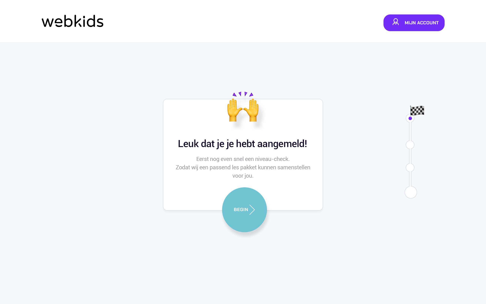
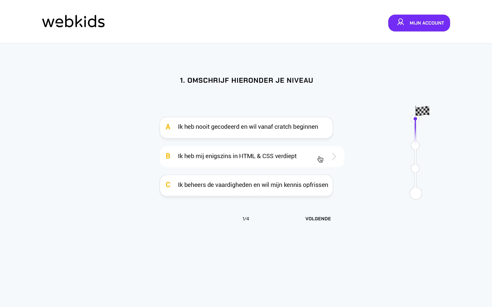
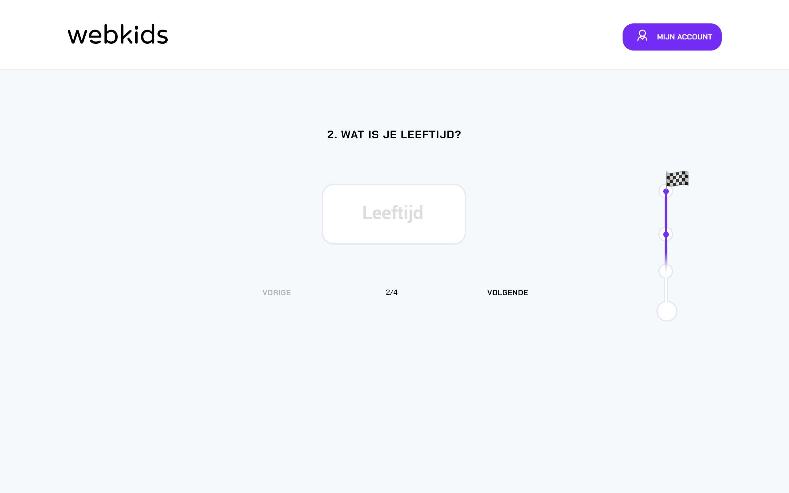
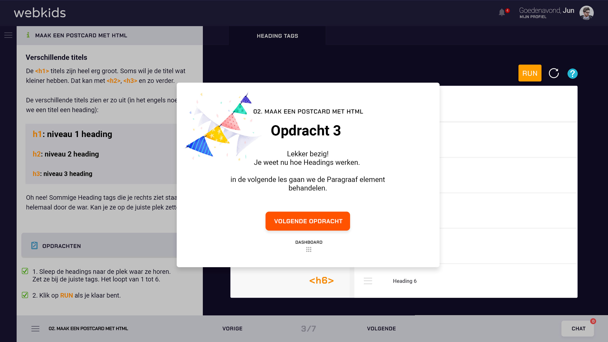

# Prototype v1.0

### Prototype v1.0

Onderstaande link verwijst je door naar het uiteindelijke klikbaar prototype.



### Visuals v1.0

### Frontpage - home

### Frontpage - Hoe het werkt 

### Frontpage - Over ons 

### Frontpage - Contact 

### Niveau check 

### Dashboard/home 

### Cursus - omschrijving 

### Cursus - opdrachten overzicht 

### Tutorial \(uitleg over hoe de leeromgeving werkt\)

### Opdrachten

### Opdracht 2

### Opdracht 3

### Opdracht 4

### Opdracht 5

### Opdracht 6

### Opdracht 7

